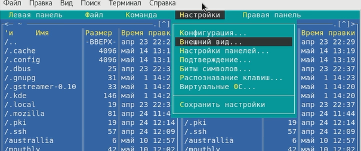
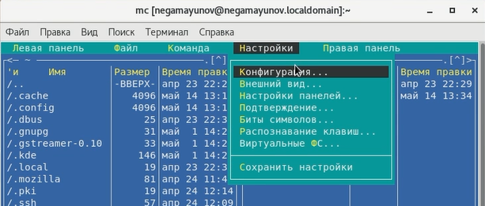
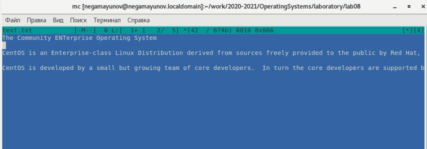

<!-- _class: titleslide -->
# Лабораторная работа №8
### Выполнил Гамаюнов Никита, 1032201719, НПМбд-01-20

---
# Прагматика выполнения работы
**Цель:** Освоение основных возможностей командной оболочки Midnight Commander.
Приобретение навыков практической работы по просмотру каталогов и файлов; манипуляций с ними.

**Задача:**  Ознакомиться с возможностями Midnight Commander, приобрести практические навыки по работе и манипуляциям с файлами и каталогами.

---

# Процесс выполнения работы
1. Изучил информацию о mc с помощью команды man *(рисунок 1)*

    
2. Выполнил несколько операций в mc, используя управляющие клавиши, - вызвал меню "настройки, клавишей f9 открыв меню и выбрав нужный пункт стрелками, выделял файлы с помощью Ctrl+t (повторное нажание отменяет выделение;нажатием f7 создал новый каталог.

    

---
3. Поочерёдно воспользовался командами меню Файл, Команда и Настройки, а также меню управления панелями.

---
4. Изучил работу с текстом во встроенном редакторе

---

<!-- _class: titleslide -->
# Выводы
Я освоил основные возможности командной оболочки Midnight Commander и приобрёл навыки практической работы по просмотру каталогов и файлов; манипуляций с ними.