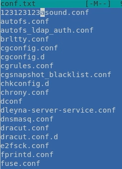
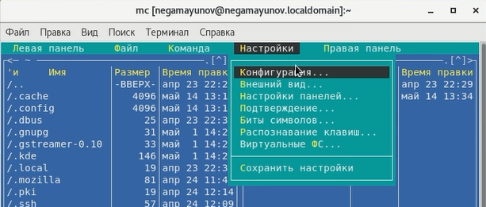
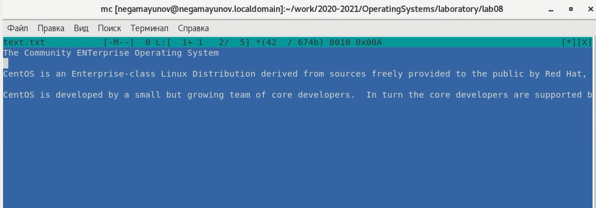

 

# Лабораторная работа №8 

**По дисциплине Операционнные системы**- 

Выполнил Гамаюнов Н.Е., студент ФФМиЕН РУДН, НПМбд-01-20, 1032201717

Преподаватель Кулябов Дмитрий Сергеевич

Москва, 2021 г.

 

# Цель работы
Освоение основных возможностей командной оболочки Midnight Commander.
Приобретение навыков практической работы по просмотру каталогов и файлов; манипуляций с ними.

# Задания
Ознакомиться с возможностями Midnight Commander, приобрести практические навыки по работе и манипуляциям с файлами и каталогами.

# Выполнение лабораторной работы
## Задание по mc
1. Изучил информацию о mc с помощью команды man *(рисунок 1)*

    

    Рисунок 1.

2. Запустил mc из коммандоной строки, ознакомился с его меню и структурой *(рисунок 2)*

    

    Рисунок 2.

3. Выполнил несколько операций в mc, используя управляющие клавиши, - вызвал меню "настройки, клавишей f9 открыв меню и выбрав нужный пункт стрелками *(рисунок 3)*, выделял файлы с помощью Ctrl+t (повторное нажание отменяет выделение; *рисунок 4*), нажатием f7 создал новый каталог *(рисунок 5)*.

    

    Рисунок 3.

    

    Рисунок 4.

    

    Рисунок 5.

4. Выполнил основные команды меню левой панели. С их помощью можно получить практически всю информацию о файлах *(рисунки 6-8)*

    

    Рисунок 6.

    

    Рисунок 7.

    

    Рисунок 8.

5. Используя возможности подменю Файл, выполнил:
    - просмотр содержимого текстового файла *(рисунок 9)*;
    - редактирование содержимого текстового файла (без сохранения результатов редактирования) *(рисунок 10)*;
    - создание каталога *(рисунок 11)*;
    - копирование в файлов в созданный каталог *(рисунок 12)*.

    

    Рисунок 9.

    

    Рисунок 10.

    

    Рисунок 12.

    

    Рисунок 13.

6.  С помощью соответствующих средств подменю Команда осуществил:
- поиск в файловой системе файла с заданным названием: abc1 *(рисунок 14)*;
- выбор и повторение одной из предыдущих команд *(рисунок 15)*;
- переход в домашний каталог *(рисунок 16)*;
- анализ файла расширений и файла меню *(рисунок 17)*.

    

    Рисунок 14.

    

    Рисунок 15.

    

    Рисунок 16.

    

    Рисунок 17.

7. Вызвал подменю Настройки *(рисунок 18)*. Освоил операции, определяющие структуруэкрана mc (*рисунок 19)*.

    

    Рисунок 18.

    

    Рисунок 19.

## Задание по встроенному редактору mc
1. Создал файл text.txt *(рисунок 20)*.
   
    

    Рисунок 20.

2. Открыл его с помощью встроенного в mc редактора *(рисунок 21)*

    

    Рисунок 21.

3. Вставил в открытый файл небольшой фрагмент текста, скопированный из приветствия в браузере *(рисунок 22)*

    

    Рисунок 22.

4. Проделал с текстом ряд манипуляций, используя горячие клавиши:
   - удалил верхнюю строку с помощью crtl+y *(рисунок 23)*

        

        Рисунок 23.

    - скопировал часть текста и здесь же его вставил, пользуясь f3 для выделения, f5 и insert для копирования и вставки соответственно *(рисунок 24)*

        

        Рисунок 24.

    - выделил часть текста с помощью f3 и перенёс его на новую строку с помощью f6 *(рисунок 25)*

        

        Рисунок 25.

    - сохранил файл с помощью клавиши f2
    - отменил последнее действие нажатием сочетания ctrl+u, вернувшись к этапу выделения текста

        

        Рисунок 26.

    - перешёл в конец файла с помощью клавиши end
    - перешёл в начало файла клавишей home
    - снова сохранил файл с помощью f2 и закрыл клавишей f10.
5. Создал новый файл с разшением .c и написал несного кода на C *(рисунок 27)*. Как мы видим, синтаксис подсвечен.

     

    Рисунок 27.

6.  Выключил подсветку синтаксиса во вкладке настройки - цветовыделение синтаксиса *(рисунок 28)*

     

    Рисунок 28.

# Выводы
Я освоил основные возможности командной оболочки Midnight Commander и приобрёл навыки практической работы по просмотру каталогов и файлов; манипуляций с ними.

# Ответы на контрольные вопросы
1. Можно выбрать один из двух режимов работы панелей: Информация или Дерево. В режиме Информация на панель выводятся сведения о файле и текущей файловой системе, расположенных на активной панели. В режиме Дерево на одной из панелей выводится структура дерева каталогов.
2. Из оболочки mc и из терминала файлы можно, например, копировать (F5/cp), перемещать (F6/mv), удалять (F8/rm).\
3. Во всплывающем меню управления одной из панелей можно найти: "Быстрый просмотр", позволяющий просмотреть содержимое файла, "Информация" выводит информацию о выделенном каталоге или файле, "Дерево" и "Просмотр файлов" переключают режим отображения. Также можно изменять формат отображения, сортировать файлы или применять фильтр, который будет выводить файлы, которые чем-то схожи (например, названием)
4. В меню Файл содержится перечень команд, которые могут быть применены к одному или нескольким файлам или каталогам

    Команды меню Файл:
   - Просмотр (F3) — позволяет посмотреть содержимое текущего (или выделенного) файла без возможности редактирования.
    - Просмотр вывода команды (М + !) — функция запроса       команды с параметрами (аргумент к текущему выбранному файлу).
   -  Правка (F4) — открывает текущий (или выделенный) файл для его редактирования.
   - Копирование (F5) — осуществляет копирование одного или нескольких файлов
или каталогов в указанное пользователем во всплывающем окне место.
   - Права доступа (Ctrl-x+c) — позволяет указать (изменить)    права доступа к одному или нескольким файлам или каталогам.
   - Жёсткая ссылка (Ctrl-x+l) — позволяет создать жёсткую ссылку к текущему (или выделенному) файлу
   - Символическая ссылка (Ctrl-x+s) — позволяет создать символическую ссылку к текущему (или выделенному) файлу.
   - Владелец/группа (Ctrl-x+o) — позволяет задать (изменить) владельца и имя
группы для одного или нескольких файлов или каталогов.
   - Права (расширенные) — позволяет изменить права доступа и владения для одного или нескольких файлов или каталогов.
   - Переименование (F6) — позволяет переименовать (или переместить) один или
несколько файлов или каталогов.
   - Создание каталога (F7) — позволяет создать каталог.
   - Удалить (F8) — позволяет удалить один или несколько файлов или каталогов.
   - Выход (F10) — завершает работу mc

5. В меню Команда содержатся более общие команды для работы с mc.

    Команды меню Команда:
    - Дерево каталогов — отображает структуру каталогов системы.
    - Поиск файла — выполняет поиск файлов по заданным параметрам.
    - Переставить панели — меняет местами левую и правую панели.
    - Сравнить каталоги (Ctrl-x+d) — сравнивает содержимое двух каталогов.
    - Размеры каталогов — отображает размер и время изменения каталога (по умолчанию в mc размер каталога корректно не отображается).
    - История командной строки — выводит на экран список ранее выполненных в оболочке команд.
    - Каталоги быстрого доступа (Ctrl-\ ) — при вызове выполняется быстрая смена текущего каталога на один из заданного списка.
    - Восстановление файлов — позволяет восстановить файлы на файловых системах ext2 и ext3.
    - Редактировать файл расширений — позволяет задать с помощью определённого синтаксиса действия при запуске файлов с определённым расширением (например, какое программного обеспечение запускать для открытия или редактирования файлов с расширением doc или docx).
    - Редактировать файл меню — позволяет отредактировать контекстное меню пользователя, вызываемое по клавише F2 .
    - Редактировать файл расцветки имён — позволяет подобрать оптимальную для пользователя расцветку имён файлов в зависимости от их типа.

6. Меню Настройки содержит ряд дополнительных опций по внешнему виду и функциональности mc.

    Меню Настройки содержит:

    -  Конфигурация — позволяет скорректировать настройки работы с панелями.
    - Внешний вид и Настройки панелей — определяет элементы (строка меню, командная строка, подсказки и прочее), отображаемые при вызове mc, а также геометрию расположения панелей и цветовыделение.
    - Биты символов — задаёт формат обработки информации локальным терминалом.
    - Подтверждение — позволяет установить или убрать вывод окна с запросом подтверждения действий при операциях удаления и перезаписи файлов, а также при выходе из программы.
    - Распознание клавиш — диалоговое окно используется для тестирования функциональных клавиш, клавиш управления курсором и прочее.
    - Виртуальные ФС –– настройки виртуальной файловой системы: тайм-аут, пароль и прочее.

7. Встроенные команды mc (функциональные клавиши):
- F1 - Вызов контекстно-зависимой подсказки
- F2 - Вызов пользовательского меню с возможностью создания и/или дополнения дополнительных функций
- F3 - Просмотр содержимого файла, на который указывает подсветка в активной панели (без возможности редактирования)
- F4 - Вызов встроенного в mc редактора для изменения содержания файла, на который указывает подсветка в активной панели
- F5 - Копирование одного или нескольких файлов, отмеченных в первой
(активной) панели, в каталог, отображаемый на второй панели
- F6 - Перенос одного или нескольких файлов, отмеченных в первой (активной) панели, в каталог, отображаемый на второй панели
- F7 - Создание подкаталога в каталоге, отображаемом в активной панели
- F8 - Удаление одного или нескольких файлов (каталогов), отмеченных в первой (активной) панели файлов
- F9 - Вызов меню mc
- F10 - Выход из mc
8. Встроенный в mc редактор вызывается с помощью функциональной клавиши F4. В нём удобно использовать различные комбинации клавиш при редактировании содержимого (как правило текстового) файла.

    Клавиши для редактирования файла
   - Ctrl-y - удалить строку
   - Ctrl-u - отмена последней операции
   - Ins - вставка/замена
   - F7 - поиск (можно использовать регулярные выражения)
   - Shift+F7 - повтор последней операции поиска
   - F4 - замена
   - F3 - первое нажатие — начало выделения, второе — окончание выделения
   - F5 - копировать выделенный фрагмент
   - F6 - переместить выделенный фрагмент
   - F8 - удалить выделенный фрагмент
   - F2 - записать изменения в файл
   - F10 - выйти из редактора
9. В меню "Команда" - "Файл меню" можно отредактировать контекстное меню пользователя, вызываемое по клавише F2.
10. Определить и выполнить действия над файлами можно в меню "Файл", а так же часть таких команд можно добавить в пользовательское меню.

    Источник всей информации, которой я пользовался - [методические рекомедации к лабораторной работе](https://esystem.rudn.ru/pluginfile.php/1142081/mod_resource/content/3/005-lab_mc.pdf)

# Библиография
- [Кулябов Д. С. и др. Операционные системы. Методические рекомендации к лабораторной работе №8](https://esystem.rudn.ru/pluginfile.php/1142081/mod_resource/content/3/005-lab_mc.pdf)
